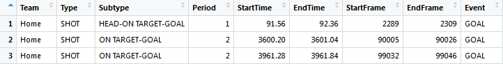
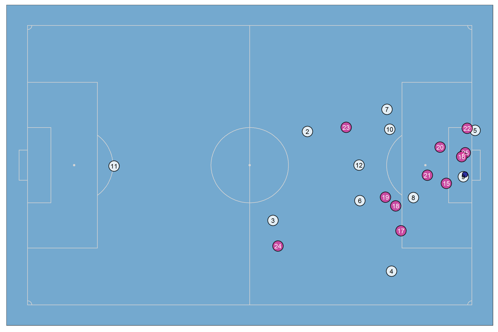
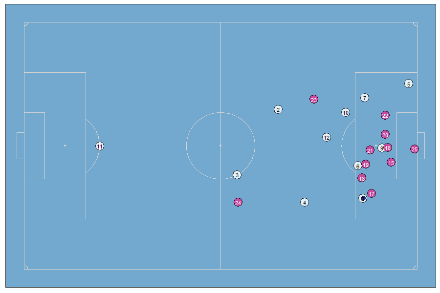
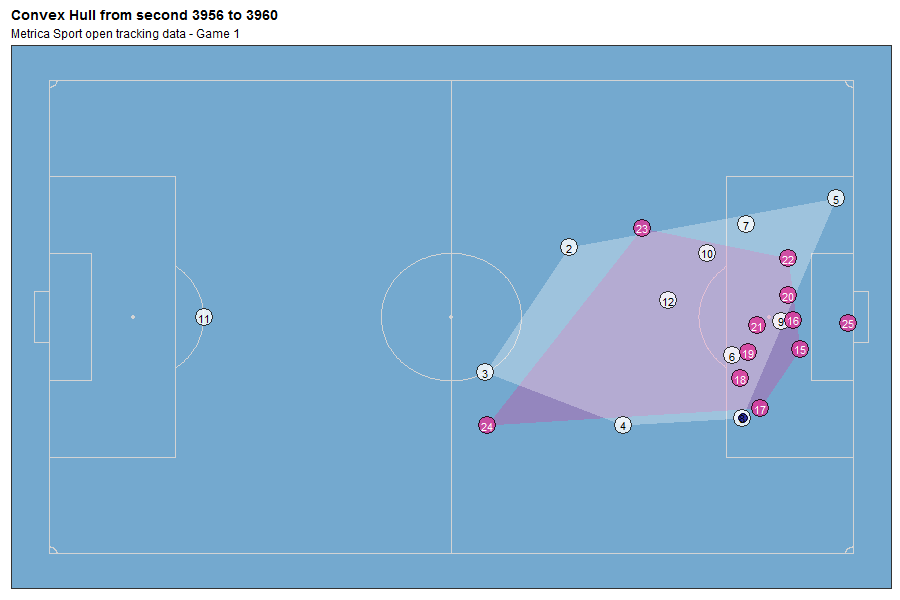
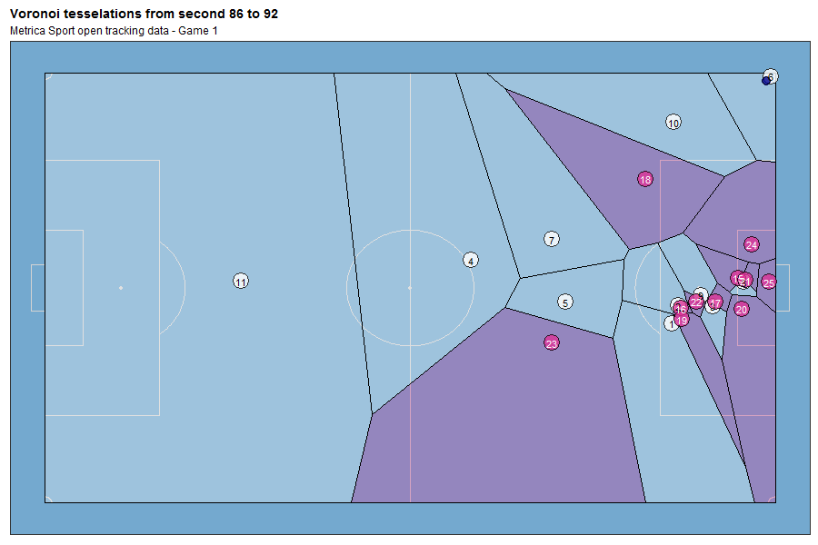

soccerAnimate
=============

An R package to create 2D animations of soccer tracking data

How to install it?
------------------

    # install.packages("remotes")
    remotes::install_github("Dato-Futbol/soccerAnimate")

How to use it?
--------------

Version 0.1.0 (23-08-2020) allows you to do the following tasks:

### 1) To get and process the data

**get\_tidy\_data()** function reads, tidies and joins the rawdata of both the Home and Away teams. Currently only data from the provider Metrica Sport is supported. Even you could download the open tracking/event data following [this link](https://github.com/metrica-sports/sample-data), it is also possible to get the processed data using the function *get\_tidy\_data()* with the URLs of rawdata directly like the example for the Game 1:

    library(soccerAnimate)
    home_team_file <- "https://raw.githubusercontent.com/metrica-sports/sample-data/master/data/Sample_Game_1/Sample_Game_1_RawTrackingData_Home_Team.csv"
    away_team_file <- "https://raw.githubusercontent.com/metrica-sports/sample-data/master/data/Sample_Game_1/Sample_Game_1_RawTrackingData_Away_Team.csv"
    td <- get_tidy_data(home_team_file, away_team_file)

If you have another dataset to share, please let me know in order to adapt the code.

### 2) To get events information

**events\_info()** function gets events information from the event dataset (Period, Team, Event, start and end time, start and end frame, etc.). You could get info for either shots, goals, free kicks or corner kicks. One of the current main usefulness of this is to know at which times/frames specific events occurs, then you will create both static plots and animations for those times/frames.

    ed <- readr::read_csv("https://raw.githubusercontent.com/metrica-sports/sample-data/master/data/Sample_Game_1/Sample_Game_1_RawEventsData.csv")
    goals <- events_info(ed, events = "GOAL")

    # all_events <- events_info(ed, events = c("SHOT", "GOAL", "FREE KICK", "CORNER KICK"))

### 3) To create a 2D static plot

**soccer\_plot()** function creates a static plot of one specific and unique **frame**. It is useful to explore and pre visualize your data, aesthetic and method setting, before to create the animation (whose creation time will be longer). You are able to export this plots as PNG files.

    soccer_plot(tidy_data = td, frame = 99035, export_png = T)

### 4) To create a 2D soccer animation

**soccer\_animate()** function creates 2D soccer animations using tracking data. You are able to set multiple arguments besides tidy tracking data, like initial and end time to animate (in seconds, no frames!), geometric or spatial analysis method (options: "base", "convexhull", "voronoi", "delaunay"), aesthetics setting (colors of pitch fill and lines, teams colors, titles, etc.), data provider and output setting. Most of this arguments are enabled also for **soccer\_plot()** function.

    # example A
    soccer_animate(tidy_data = td, ini_time = 3956, end_time = 3960)

    # example B
    soccer_animate(tidy_data = td, ini_time = 3956, end_time = 3960, method = "convexhull", title = "Convex Hull from second 3956 to 3960", subtitle = "Metrica Sport open tracking data - Game 1")

    # example C
    soccer_animate(tidy_data = td, ini_time = 86, end_time = 92, method = "voronoi", title = "Voronoi tesselations from second 86 to 92", subtitle = "Metrica Sport open tracking data - Game 1")

General considerations
----------------------

-   A soccer pitch of dimensions 105x68 meters was considered.
-   Reverted coordinates for Period 2: Teams are always attacking in the same direction.

### Currently working on

-   Players and teams stats report (minutes played, distance, velocity)
-   Adding events visualization
-   Improving documentation
-   More aesthetics user customization (color/fill themes, fonts)
-   Creating the hex sticker (!)

### TO DO

-   Implement soccer analytics community applications, like [pitch control model](https://github.com/Friends-of-Tracking-Data-FoTD/LaurieOnTracking/blob/master/Metrica_PitchControl.py)

-   **open to suggestions**
